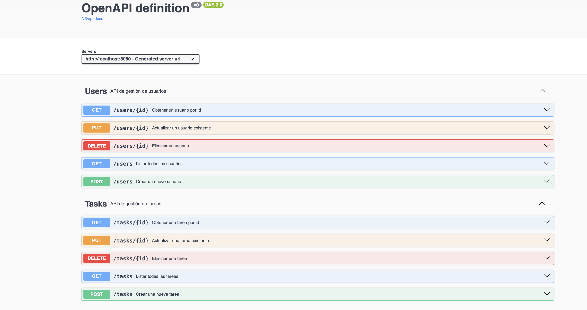
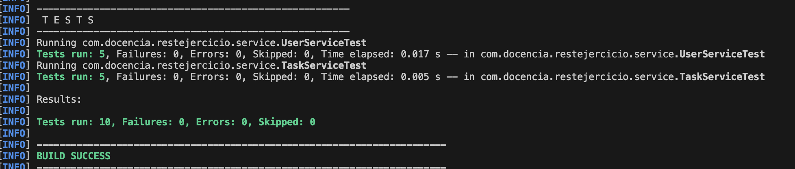

# Examen PGV Servicios

Este ejercicio pretende crear **dos servicios REST** con Spring Boot, documentados con **Swagger / OpenAPI** (springdoc) y verificar con **tests unitarios en la capa de servicio**
usando los **repositorios reales en memoria**, inicializados con **dos elementos** en cada test (`esto se encuentra realizado`). 

Los servicios se publicano por defecto en `/api`. Por eso debes de realizar los cambios necesarios para publicar en:
   - /tasks"
   - /users"

   

## En el ejercicio debes de:

1. Crear una aplicación Spring Boot con:
   - Un servicio REST de **tareas** (`Task`).
      - Debes de hacer uso del servicio correspondiente.
      - Debes de hacer uso del repositirio correspondiente. Incluye por defecto del elemenos para visualizar a través del navegador.
   - Un servicio REST de **usuarios** (`User`).
      - Debes de hacer uso del servicio correspondiente.
      - Debes de hacer uso del repositirio correspondiente. Incluye por defecto del elemenos para visualizar a través del navegador.
2. Documentar los endpoints con **Swagger / OpenAPI** usando `springdoc-openapi`.
4. Escribir los servicios de la capa de servicio (`TaskService` y `UserService`) que:
   - Utilicen el **repositorio real en memoria** .
   - Inicialicen el repositorio en cada test con **dos elementos de ejemplo**.
   - Este documentada tal y como muestra la siguiente imagen:
   
     
---

## Estructura propuesta

```text
rest-ejercicio/
├─ pom.xml
├─ README.md
└─ src
   ├─ main
   │  └─ java
   │     └─ com
   │        └─ ejemplo
   │           └─ restejercicio
   │              ├─ RestEjercicioApplication.java
   │              ├─ common
   │              │  └─ ApiRestController.java
   │              ├─ controller
   │              │  ├─ TaskController.java
   │              │  └─ UserController.java
   │              ├─ model
   │              │  ├─ Task.java
   │              │  └─ User.java
   │              ├─ repository
   │              │  ├─ TaskRepository.java
   │              │  └─ UserRepository.java
   │              └─ service
   │                 ├─ TaskService.java
   │                 └─ UserService.java
   └─ test
      └─ java
         └─ com
            └─ ejemplo
               └─ restejercicio
                  └─ service
                     ├─ TaskServiceTest.java
                     └─ UserServiceTest.java
```

---

## Endpoints principales

Todos los endpoints comparten el prefijo `/api` gracias a la anotación personalizada `@ApiRestController`.

### Tasks

- `GET    /api/tasks` — Listar todas las tareas
- `GET    /api/tasks/{id}` — Obtener una tarea por id
- `POST   /api/tasks` — Crear una nueva tarea
- `PUT    /api/tasks/{id}` — Actualizar una tarea existente
- `DELETE /api/tasks/{id}` — Eliminar una tarea

### Users

- `GET    /api/users` — Listar todos los usuarios
- `GET    /api/users/{id}` — Obtener un usuario por id
- `POST   /api/users` — Crear un nuevo usuario
- `PUT    /api/users/{id}` — Actualizar un usuario existente
- `DELETE /api/users/{id}` — Eliminar un usuario

---

## Swagger / OpenAPI

Con la dependencia `springdoc-openapi-starter-webmvc-ui`, la documentación y la interfaz de pruebas
estarán disponibles en:

- `http://localhost:8080/swagger-ui.html`

Allí se pueden explorar los endpoints `Tasks` y `Users`, ver los modelos y probar peticiones.

---


## Tests con repositorios reales

En `TaskServiceTest` y `UserServiceTest`:

- Se crea una **instancia real** de `TaskRepository` o `UserRepository`.
- En el método `@BeforeEach`, se insertan **dos elementos de ejemplo** en el repositorio.
- Luego se crea el servicio (`TaskService` o `UserService`) usando ese repositorio.
- Cada test verifica la lógica del servicio (listado, búsqueda, creación, actualización, borrado)
  contra ese repositorio en memoria.

Para ejecutarlos:

```bash
mvn clean test
```

  

## Lanzar el servicio:

Para levantar el servicio debes de ejecutar:

```bash
mvn clean spring-boot:run
```

---